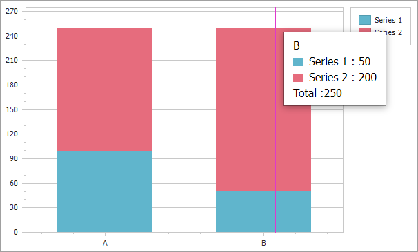

<!-- default badges list -->

<!-- default badges end -->
<!-- default file list -->
<!-- default file list end -->
# Chart for ASP.NET Web Forms - How to display the "Total" point value in the Crosshair Panel

This example illustrates how to display the "Total" point value in the crosshair cursor panel.

To accomplish this task, handle the client-side [CustomDrawCrosshair](https://docs.devexpress.com/AspNet/js-ASPxClientWebChartControl.CustomDrawCrosshair) event and include the Total value with the `LabelElement.footerText` property of the last crosshair panel element.

## Files to Review

* [Default.aspx](./CS/WebSite/Default.aspx) (VB: [Default.aspx](./VB/WebSite/Default.aspx))

## Documentation 

* [Crosshair Cursor Customization](https://docs.devexpress.com/AspNet/16017/components/chart-control/concepts/end-user-interaction/crosshair-cursor/crosshair-cursor-customization?p=netframework)

